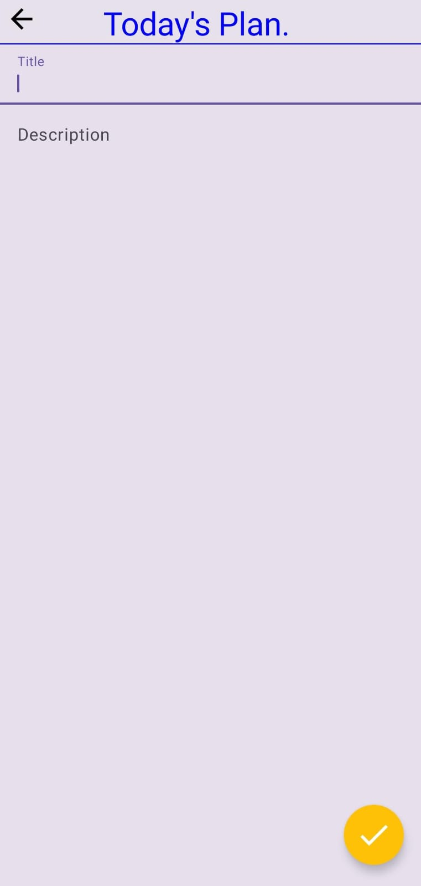

# 📝 Note-Taking App with Firebase

A simple and clean Note-Taking App built using Firebase for real-time database support. Users can create, edit, and delete notes with data securely stored in the cloud.

## 🚀 Features

- Create, update, and delete notes
- Real-time data sync using Firebase
- Clean and minimal user interface
- Data saved securely in the cloud

## 🛠️ Tech Stack

- **Frontend**: Android (Jetpack Compose)
- **Backend**: Firebase Realtime Database / Firestore

## 📸 Screenshots

| Splash Screen      | Add Note               | Notes List                |
|--------------------|------------------------|---------------------------|
|  |  |  |

